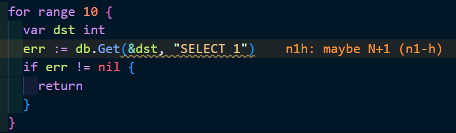

# n1-h

N+1っぽいコードを検知するlinter。go vetとgolangci-lintのModule Plugin対応。
`github.com/jmoiron/sqlx`を想定。

```sh
go vet -vettool=$(which n1-h)
```

## golangci-lint の Plugin として使う

1. v1.57.0以上のgolangci-lintを入れる。
2. このディレクトリで`golangci-lint custom`を実行すると、`isu-golangci-lint`というバイナリファイル(プラグインが入ったgolangci-lint)ができる。
3. 使いたいリポジトリに[`.golangci.example.yml`](./.golangci.example.yml)を参考にしてプラグインを有効にした`.golangci.yml`を置く。

### VSCode で使う

↑の手順をやったあと、

1. 2で生成されたプラグインが入ったgolangci-lintのバイナリを、パスが通ってる場所に置く。
2. 使いたいディレクトリで、[`.vscode_settings.example.json`](./.vscode_settings.example.json)を参考に、Linterをgolangci-lintに設定し、使うバイナリを上書きする。
3. 再起動とかするとN+1っぽいところにwarning出してくれる。


